<br><br>

<!-- project philosophy -->


> A website designed to help job seekers, freelancers, and entrepreneurs turn their rejections into opportunities. By providing a space for users to share their rejected proposals, job applications, or project ideas. 
>
> Rejectedly aims to create a supportive community where members can learn from each other’s experiences, improve their skills, and discover new opportunities. By providing a user-friendly website where users can upload their rejected stories, get the analysis using artificial intelligence, and collaborate with others. we believe that rejection doesn't have to be the end of the road, there is always a second chance.

### User Stories/User

- As a user, I want to be able to reset my password, so that I can regain access to my account if I forget my password or suspect that my account has been compromised for security purposes.
- As a user of Rejectedly, I want to be able to upload my rejection letters or feedback for analysis, so that I can identify the points that need improvements.
- As a user, I want to save my rejection stories, so that I can reflect on them later.
- As a user, I want to receive actionable suggestions on how to improve my approach, so that I can implement changes and see better results.
- As a user, I want to be able to delete a story, so that I can remove stories that i don't need.
- As a user, I want to edit my profile information so that I can update my personal details or change my account settings as needed.
- As a user of Rejectedly, I want to be able to create a “Rejection Profile” showcasing my rejected work, so that I can receive feedback and constructive criticism from the community.
- As a user of a “Rejectedly”, I want to be able to provide and receive constructive feedback (comments) on my rejected submissions, so that I can identify areas for improvement and refine my approach.
- As a user of Rejectedly, I want to upload my rejected ideas or projects before and after improvements to the marketplace, so that I can showcase my skills and expertise.
- As a user who values personal connections, I want the option to provide my contact information (such as email, phone number, or social media handles) in my profile, so that potential clients or collaborators can reach out to me directly.

### User Stories/Admin
- As an admin, I want to view a list of all registered users, so that I can easily monitor the user base and track any potential issues.
- As an admin, I want to be able to view the total number of registered users so that I can keep track of the platform's growth and make data-driven decisions about its future development.

<br><br>

<!-- Prototyping -->


> We designed Rejectedly using wireframes and mockups, iterating on the design until we reached the ideal layout for easy navigation and a seamless user experience.

### Wireframes
| Login screen  | Register screen |  Landing screen |
| ---| ---| ---|
| 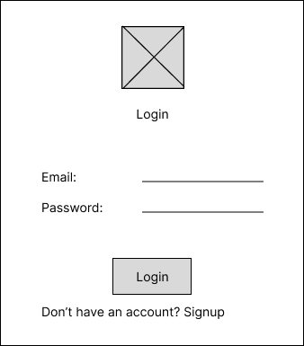 | 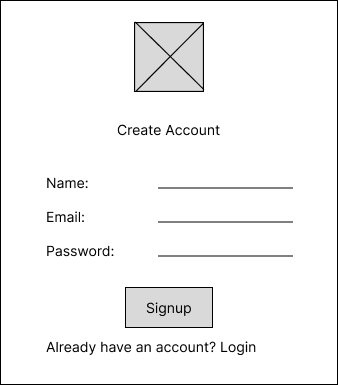 |  |

### Mockups
| Home screen  | Add Story | Edit Profile |
| ---| ---| ---|
| 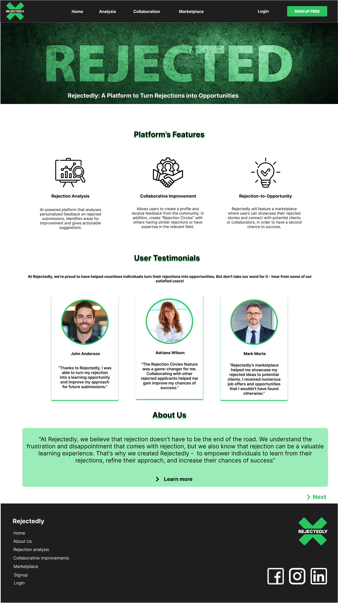 |  | 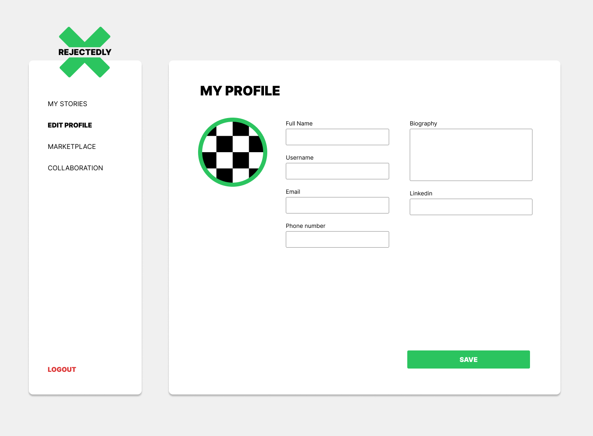 |

<br><br>

<!-- Implementation -->


> Using the wireframes and mockups as a guide, we implemented Rejectedly website with the following features:

### User Screens (web)
| Login screen  | Register screen 
| ---| ---| 
| 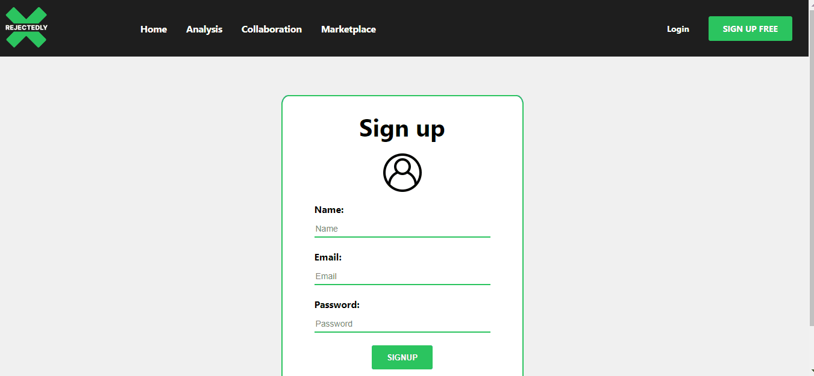 | 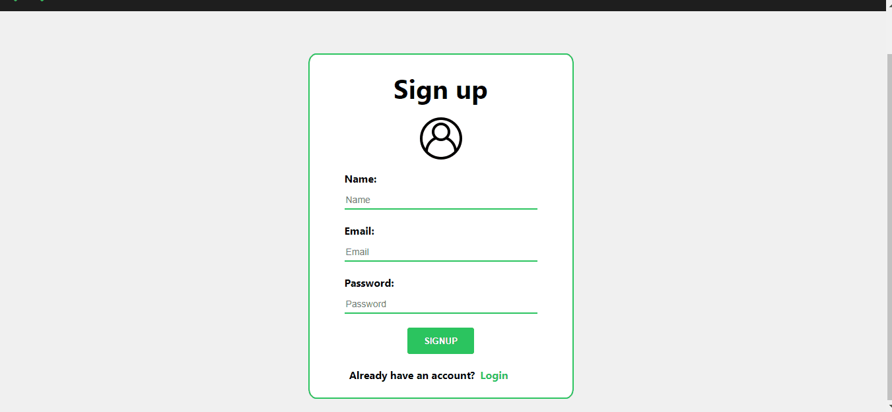 |
| Reset Password screen | Homepage screen |
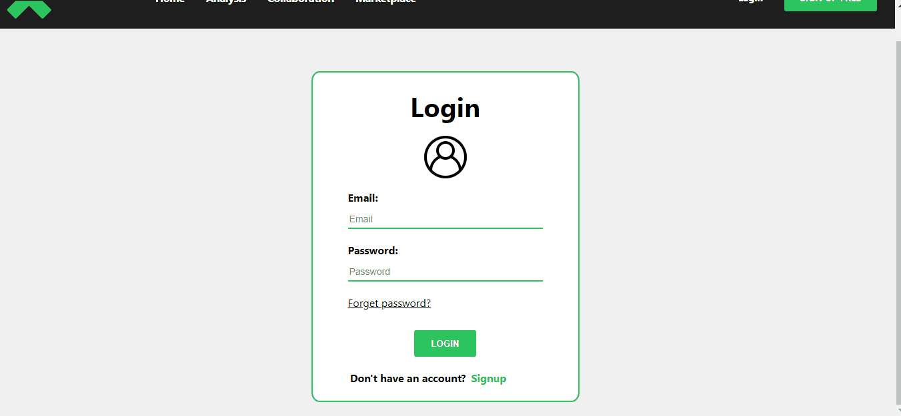 | 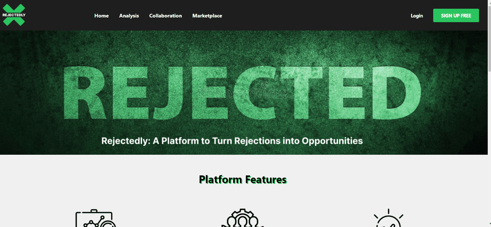 |
| Posts screen  | Marketplace Screen | Analysis Screen | StoryBoard Screen |
| 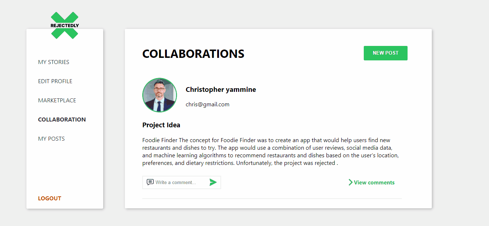 | 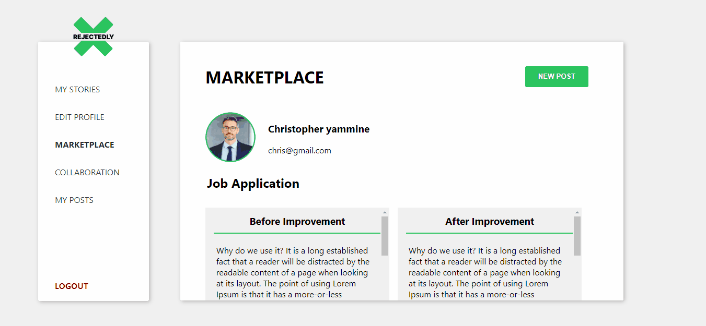 | 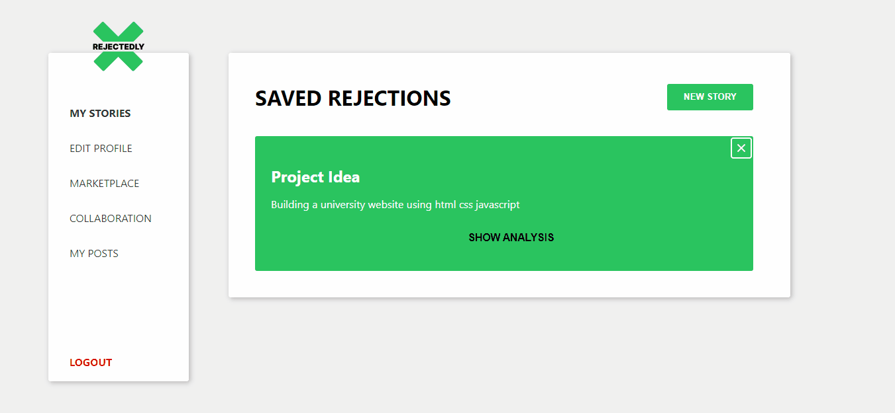 | 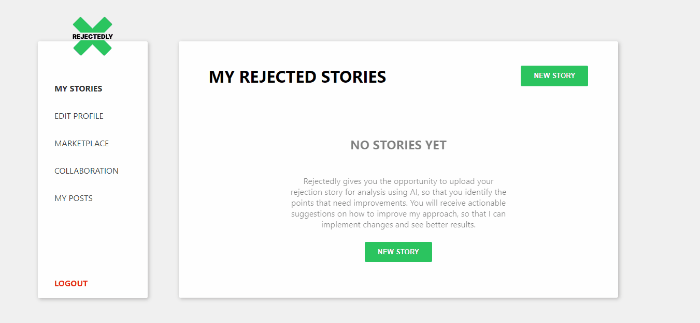 |

### Admin Screens (Web)
| Login screen  | Register screen |  Landing screen |
| ---| ---| ---|
|  | 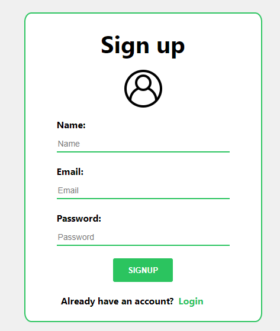 | 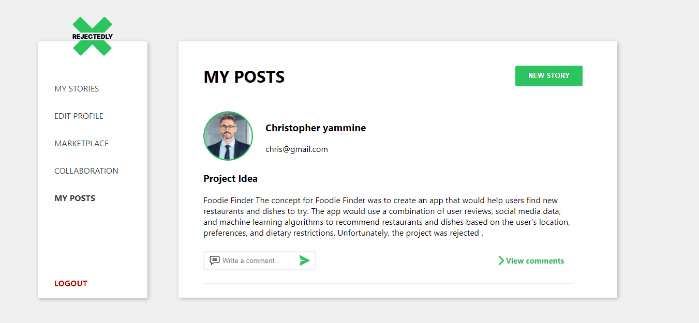 |


<br><br>

<!-- Tech stack -->


###  Rejectedly is built using the following technologies:

- This project uses ReactJS for the frontend and Laravel for the backend. ReactJS is a popular JavaScript library for building user interfaces, while Laravel is a PHP framework for web application development.
- For persistent storage, the application uses MySQL to store data.
- To make rejection analysis, the app uses OpenAI's API that provides advanced natural language processing capabilities that allow Rejectedly to analyze and provide feedback on the content and language used in users' rejection stories.
- In terms of design, Rejectedly follows a simple and modern design with a focus on usability and user experience. The application uses a minimalist color palette with a clean and easy-to-use interface.

<br><br>

<!-- How to run -->


> To set up Rejectedly locally, follow these steps:

### Prerequisites

This is an example of how to list things you need to use the software and how to install them.
* npm
  ```sh
  npm install npm@latest -g
  ```

### Installation

_Below is an example of how you can instruct your audience on installing and setting up your app. This template doesn't rely on any external dependencies or services._

1. Clone the project repository
   ```sh
   git clone https://github.com/Reema224/Rejectedly.git
   ```
3. For React Install NPM packages
   ```sh
   cd Rejectedly-frontend
   npm install
   ```
3. For Laravel
   ```sh
   cd Rejectedly-server
   composer install
   ```   
4. Set up the database: The user needs to set up the database for the Laravel backend. The user can create a database on their local machine and update the .env file in the Laravel project with the database credentials. The .env file should be present in the Rejectedly-server directory.


5. Run the migrations
   ```sh
   cd Rejectedly-server
   php artisan migrate
   ```
6. Start the server for Laravel:

   ```sh
   cd Rejectedly-server
   php artisan serve
   
   ```  
6. Start the server for React:

   ```sh
   cd Rejectedly-frontend
   npm start
   
   ```    
   

Now, you should be able to run Rejectedly locally and explore its features.