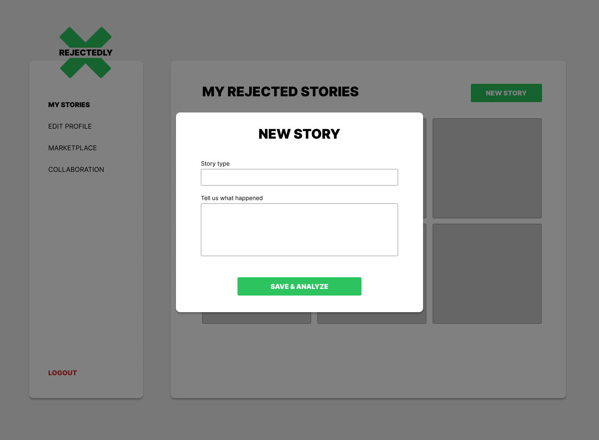
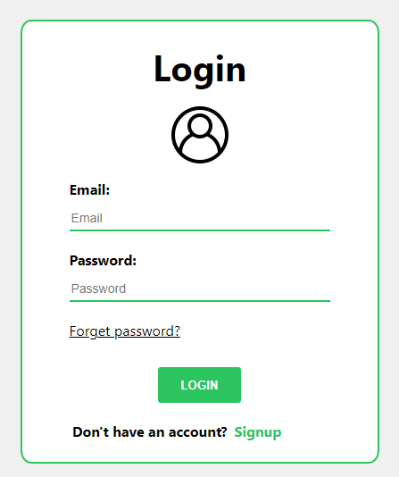
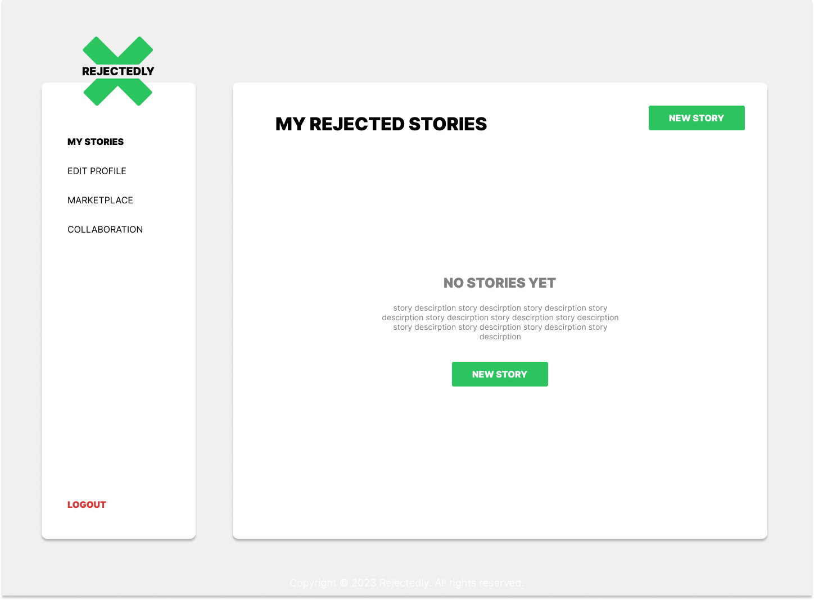
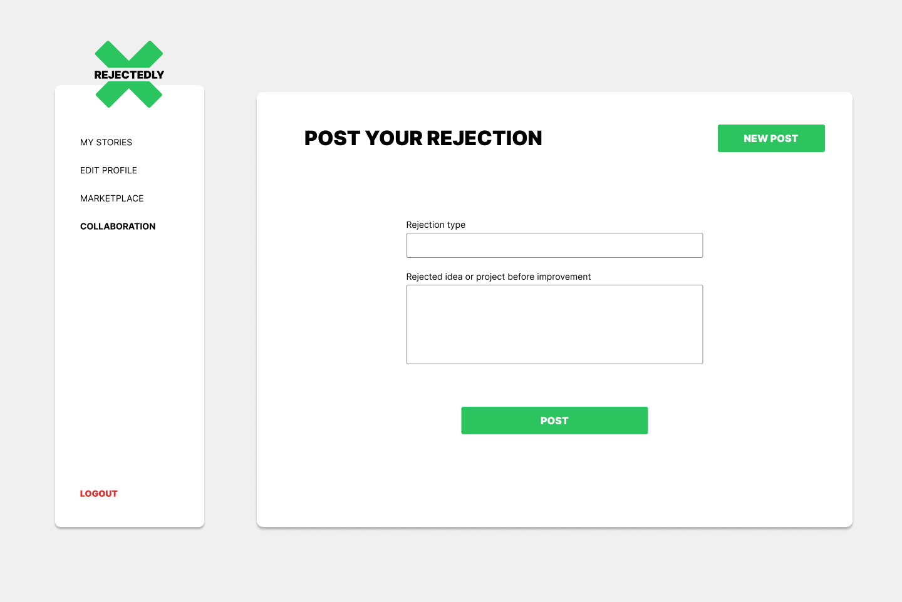
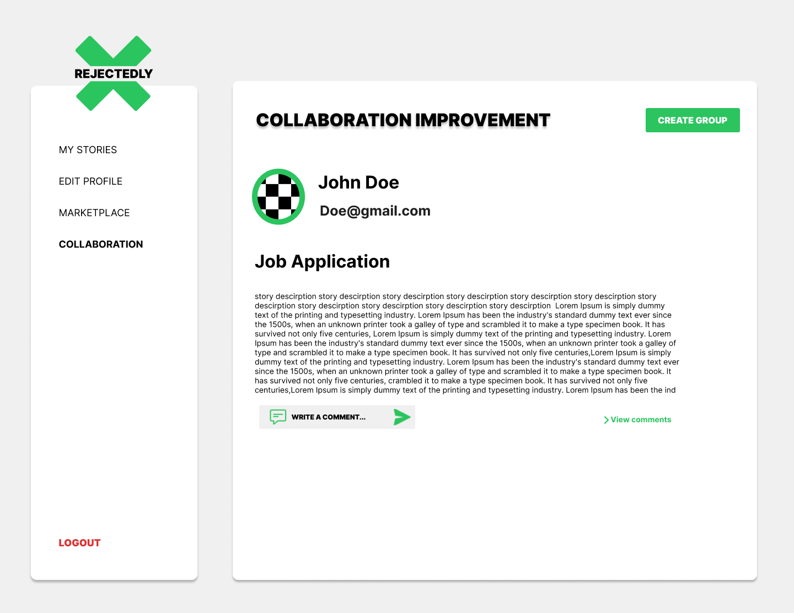
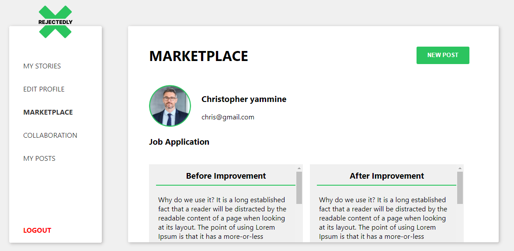
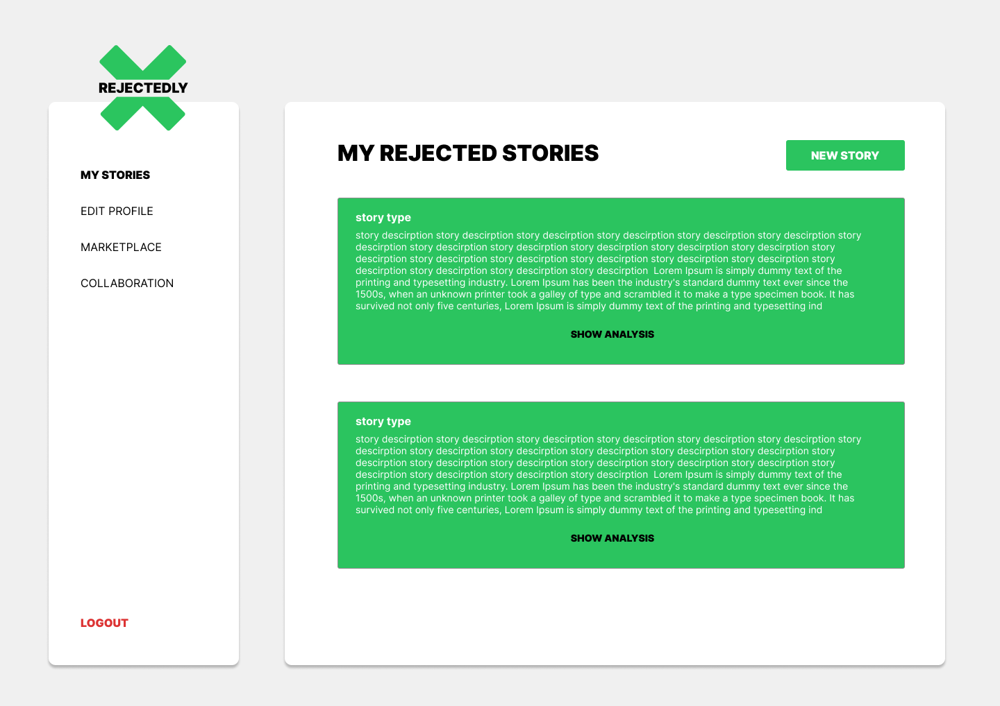

<br><br>

<!-- project philosophy -->


> A website designed to help job seekers, freelancers, and entrepreneurs turn their rejections into opportunities. By providing a space for users to share their rejected proposals, job applications, or project ideas. 
>
> Rejectedly aims to create a supportive community where members can learn from each other’s experiences, improve their skills, and discover new opportunities. By providing a user-friendly website where users can upload their rejected stories, get the analysis using artificial intelligence, and collaborate with others. we believe that rejection doesn't have to be the end of the road, there is always a second chance.

### User Stories
- As a user, I want to create a Rejectedly account, so that I can access the platform's features and become a part of the community.
- As a returning user, I want to be able to log in to my Rejectedly account, so that I can access my profile and use the platform's features.
- As a user of Rejectedly, I want to be able to log out of my account, so that I can ensure the security of my account and prevent unauthorized access by others.
- As a user of Rejectedly, I want to be able to upload my rejection letters or feedback for analysis, so that I can identify the points that need improvements.
- As a user, I want to receive actionable suggestions on how to improve my approach, so that I can implement changes and see better results.
- As a user, I want to edit my profile information so that I can update my personal details or change my account settings as needed.
- As a user of Rejectedly, I want to be able to create a “Rejection Profile” showcasing my rejected work, so that I can receive feedback and constructive criticism from the community.
- As a user of a “Rejectedly”, I want to be able to provide and receive constructive feedback (comments) on my rejected submissions, so that I can identify areas for improvement and refine my approach.
- As a user of Rejectedly, I want to upload my rejected ideas or projects before and after improvements to the marketplace, so that I can showcase my skills and expertise.
- As a user who values personal connections, I want the option to provide my contact information (such as email, phone number, or social media handles) in my profile, so that potential clients or collaborators can reach out to me directly.

<br><br>

<!-- Prototyping -->


> We designed Coffee Express using wireframes and mockups, iterating on the design until we reached the ideal layout for easy navigation and a seamless user experience.

### Wireframes
| Login screen  | Register screen |  Landing screen |
| ---| ---| ---|
|  |  |  |

### Mockups
| Home screen  | Add Story | Edit Profile |
| ---| ---| ---|
|  |  |  |

<br><br>

<!-- Implementation -->


> Using the wireframes and mockups as a guide, we implemented Rejectedly website with the following features:

### User Screens (web)
| Login screen  | Register screen | Landing screen | AddPost screen |
| ---| ---| ---| ---|
|  |  |  |  |
| Posts screen  | Marketplace Screen | Analysis Screen | StoryBoard Screen |
|  |  |  |  |

### Admin Screens (Web)
| Login screen  | Register screen |  Landing screen |
| ---| ---| ---|
|  |  |  |
| Home screen  | Menu Screen | Order Screen |
|  |  |  |

<br><br>

<!-- Tech stack -->


###  Coffee Express is built using the following technologies:

- This project uses the [Flutter app development framework](https://flutter.dev/). Flutter is a cross-platform hybrid app development platform which allows us to use a single codebase for apps on mobile, desktop, and the web.
- For persistent storage (database), the app uses the [Hive](https://hivedb.dev/) package which allows the app to create a custom storage schema and save it to a local database.
- To send local push notifications, the app uses the [flutter_local_notifications](https://pub.dev/packages/flutter_local_notifications) package which supports Android, iOS, and macOS.
  - 🚨 Currently, notifications aren't working on macOS. This is a known issue that we are working to resolve!
- The app uses the font ["Work Sans"](https://fonts.google.com/specimen/Work+Sans) as its main font, and the design of the app adheres to the material design guidelines.

<br><br>

<!-- How to run -->


> To set up Coffee Express locally, follow these steps:

### Prerequisites

This is an example of how to list things you need to use the software and how to install them.
* npm
  ```sh
  npm install npm@latest -g
  ```

### Installation

_Below is an example of how you can instruct your audience on installing and setting up your app. This template doesn't rely on any external dependencies or services._

1. Get a free API Key at [https://example.com](https://example.com)
2. Clone the repo
   ```sh
   git clone https://github.com/your_username_/Project-Name.git
   ```
3. Install NPM packages
   ```sh
   npm install
   ```
4. Enter your API in `config.js`
   ```js
   const API_KEY = 'ENTER YOUR API';
   ```

Now, you should be able to run Coffee Express locally and explore its features.